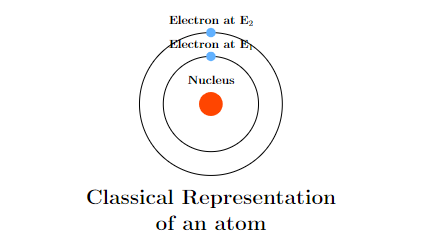

# Lasers

## Introduction

LASER means **Light Amplification by Stimulated Emission of Radiation**. To understand the mechanism of Laser, one has to understand the concept of Energy levels (which will be studied later in Quantum Field theory).

### Energy Level

An energy level is a specific, quantized state that an e⁻ can occupy in an atom or molecule, each with a fixed energy value. We will be studying about these energy levels in depth when we will be learning Quantum Physics.

**What does an atom getting excited mean?**

An atom getting excited means that the atom has gained some energy (relative to its ground state). When an electron of the atom get excited, it gains energy and as an electron is part of an atom, so the atom too does gain energy.

From whatever we know till now, when a photon is absorbed by an atom, it is more accurate to say that the electron has been excited. But, in this chapter, we will often keep atom as our point of reference. So, whenever we say that an atom has been excited, we refer to excitation of the outermost valence shell electron.

> Refer to Born-Oppenheimer approximation for a better idea on how nucleus of an atom is not affected when the photon is absorbed by the atom.

If an electron has been excited, then the atom too gets excited but if an atom has been excited, there are many possibilities. But, in this chapter, we will be only considering the excitation of the outermost valence shell electron as the only possibility.

### Energy Gap

Usually for an **isolated gaseous atom**, there are many energy levels in discrete which the electron can occupy. But, in the case of solids, due to tightly packed atoms and their orbital overlap, the discrete energy levels become very close and appear to be continuous. Such continuous energy levels are called as energy bands and the e⁻ can take any energy value between the lowest and highest value of energy band. The concept of energy bands will be discussed again in Band Theory of Solids in depth.

### Classical Representation of Atom

In classical view (an extended version of Newtonian mechanics), these energy levels are related with the orbits of the e⁻ revolving around the nucleus.

    
    <i>1.1 Classical Representation of an Atom</i>

This idea is very outdated and is wrong as we move towards the concept of Quantum Mechanics. The atom is often represented like this in some books to keep things simple. In the quantum mechanical model of the atom, we consider electrons to be in the orbitals corresponding to their energy levels.

### Energy Level Diagrams

To explain phenomena related to interaction between radiation and matter, we need a good diagrammatic representation of an atom. As stated earlier, we are not interested in outdated classical representation of atom anymore in favour of the quantum mechanical model.

Now, if we follow the quantum mechanical model, representing orbitals in an atom is highly complicated, making it even more challenging to use those diagrams to explain certain phenomena. 

We have discussed earlier that in this chapter we are going to relate excitation of atom with the excitation of the outermost valence electron, i.e. when an electron excites from E1 to E2, the atom too goes from E1 to E2. So, instead of using electrons, orbitals or orbits, we will be using atoms and their corresponding energy levels to explain several phenomena.

    
    <i>1.2. The outdated classical representation of an atom compared with energy level diagram of an atom.</i>

## References: 

- Read Basavaraju's book on Engineering Physics for fundamental ideas (Chapter 5 Lasers)

- Watch this [YT video](https://www.youtube.com/watch?v=_JOchLyNO_w&t=233s) for a complete animated video of the whole mechanism of LASER. The only con of this video will be its attempt of using the classical representation of atom in it.

- See this [Reddit post](https://www.reddit.com/r/Physics/comments/1ev7gss/are_energy_levels_for_electrons_or_atoms/) for question on energy levels.