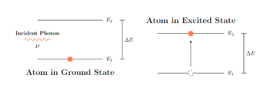

# Lasers

## Types of Interactions

Radiation and matter can interact in three different ways (one absorption, two emission). 

### Stimulated Absorption

     
    <i>2.1 Stimulated Absorption</i>

