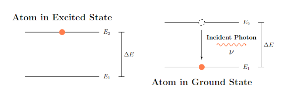
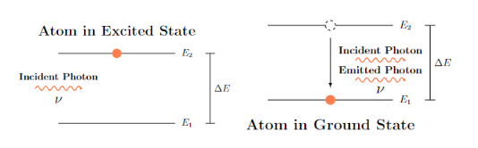

# Lasers

## Types of Interactions

Working of laser depends on the three different ways of interaction of radiation and matter. In this chapter, there will only be an introduction to the interactions and will study them later in depth in Quantum Mechanics.

**Note:** These interactions happen only in isolated atoms with discrete $E$ levels.

### Stimulated Absorption

This interaction is also called as **Induced Absorption** in some books (like in Basavaraju) while in some others, it is called as **Stimulated Absorption**.

<p align="center">
    <br/>
    <i>2.1 Stimulated Absorption</i>
</p>

Here (and for the other 2 interactions too), assume $E_{1}$ is the ground state and $E_{2}$ is some excited state of that atom.

```math

\Delta E = E_{1} - E_{2}

```

Here, the photon is absorbed by the atom to excite itself from the ground state to an excited state. This is only possible if the energy of photon is same as the energy different between two levels. So, by **Planck's formula**,

$\Delta E = h\nu$ 

### Spontaneous Emission

<p align="center">
    <br/>
    <i>2.2 Spontaneous Emission</i>
</p>

Any atom in an excited state is unstable and tends to de-excite to the ground state without any external aid (thus spontaneous). During this process, it emits an photon of an energy equal to the energy difference.

**Note:** There is an universal tendency for any system to be in the lowest energy state to keep itself stable.

Photons emitted by two atoms excited under (and are in) identical conditions undergoing spontaneous emission, **will not have any phase relationship** (i.e. in any direction and can have phase differences). So, photons emitted under this process are incoherent (i.e. no phase relationship). Such incoherent emissions can be seen in Thermoionic emission in bulb, candle flame, etc.

### Stimulated Emission

<p align="center">
    <br/>
    <i>2.3 Stimulated Emission</i>
</p>

Although, atoms can get de-excited without any external aid as seen in Spontaneous emission, they can also get de-excited by an incident photon of an energy equal to the energy difference between the excited levels. When such de-excitation happens, the atom emits another photon which will be in phase (i.e. coherent) with the incident photon.

The idea of emission can happen in two ways (i.e. spontaneous and stimulated) unlike absorption (which is only one) was proposed by Einstein in 1917.