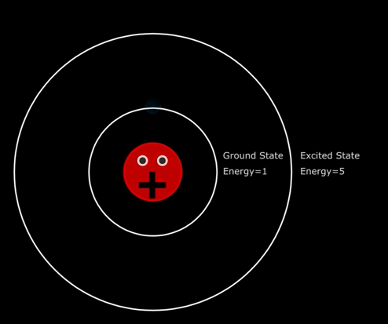

# Lasers

## Introduction

LASER means **Light Amplification by Stimulated Emission of Radiation**. To understand the mechanism of Laser, one has to understand the concept of Energy levels (which will be studied later in Quantum Field theory).

### Energy Level

An energy level is a specific, quantized state that an e⁻ can occupy in an atom or molecule, each with a fixed energy value. We will be studying about these energy levels in depth when we will be learning Quantum Physics.

**What does an atom getting excited mean?**

---

### Energy Gap

Usually for an **isolated gaseous atom**, there are many energy levels in discrete which the electron can occupy. But, in the case of solids, due to tightly packed atoms and their orbital overlap, the discrete energy levels become very close and appear to be continuous. Such continuous energy levels are called as energy bands and the e⁻ can take any energy value between the lowest and highest value of energy band. The concept of energy bands will be discussed again in Band Theory of Solids in depth.

### Classical Representation of Atom:

In classical view (an extended version of Newtonian mechanics), these energy levels are linked to the orbits of the e⁻ revolving around the nucleus.

This idea is very outdated and is wrong as we have moved towards the concept of Quantum Mechanics. The atom is often represented like this to keep things simple.

In the quantum mechanical model of the atom, we consider electrons to be in the orbitals corresponding to their energy levels. So, in this chapter, to maintain accuracy with the topic, we won't be using such diagrammatic representation of atom. Instead, we will be using energy level diagrams.

## References: 

- Read Basavaraju's book on Engineering Physics for fundamental ideas (Chapter 5 Lasers)

- Watch this [YT video](https://www.youtube.com/watch?v=_JOchLyNO_w&t=233s) for a complete animated video of the whole mechanism of LASER. The only con of this video will be its attempt of using the classical representation of atom in it.

- See this [Reddit post](https://www.reddit.com/r/Physics/comments/1ev7gss/are_energy_levels_for_electrons_or_atoms/) for your question on energy levels.